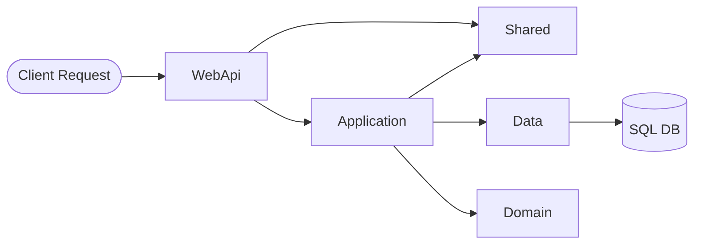

# HomeTechServiceAPI

## Overview
``HomeTechServiceAPI`` is a ``.NET Core API`` designed for practicing and improving .NET Core skills in real-world scenarios. 
This API serves as a backend service for managing service requests, user authentication, and technician assignments in a technical service environment.

## Technologies Used
- **.NET 9.0**: The API is built on the latest .NET framework, leveraging its features for performance and security.
- **Entity Framework Core**: Used for data access, providing an ORM for database operations.
- **ASP.NET Core**: The WebApi project utilizes ASP.NET Core for building RESTful services.
- **SQL Server**: The API is configured to work with SQL Server for data storage.

## Architecture
The architecture of ``HomeTechServiceAPI`` follows a layered approach:
- **Presentation Layer**: The ``WebApi`` project serves as the *entry point* for HTTP requests, handling routing and API endpoints.
- **Application Layer**: Contains the core business logic and service implementations, facilitating communication between the presentation and data layers.
- **Domain Layer**: Defines the core entities and business rules, encapsulating the domain logic.
- **Data Layer**: Manages data access and persistence, utilizing Entity Framework Core for database interactions.
- **Shared Layer**: Contains common services and utilities used across multiple layers, such as cryptography and custom exceptions.

### Architecture Diagram


---

## Getting Started
To get started with the HomeTechServiceAPI, clone the repository and restore the dependencies using:
```bash
# Restore dependencies
dotnet restore
```

## Running the API
To run the API, use the following command:
```bash
# Run the API
dotnet run --project WebApi/WebApi.csproj

```

## Request Flow
1. **Client Request → Controllers (Presentation Layer)**
	- HTTP requests enter through the WebApi Controllers
	- Controllers validate request data and delegate business logic to Application Services
	- Controllers return HTTP responses based on the results from the Application layer

2. **Controllers → Application Services**
	- Controllers invoke Application Services with DTOs (Data Transfer Objects)
	- Application Services contain the business logic and orchestration
	- Services handle validation, transformation, and coordination between layers
	- Services call Domain entities and Data repositories as needed

3. **Application Services → Domain + Data Layers**
	- Domain Layer: Provides core entities and business rules
	- Data Layer: Repositories handle data persistence and retrieval
	- Services classes communicate with repositories to perform CRUD operations
	- Repositories classes interact with Entity Framework Core and SQL Server

4. **Shared Layer (Cross-Cutting Concerns)**
	- Available to all layers for common functionality
	- Contains services like `CryptographyService` for encryption/decryption
	- Provides custom exceptions like `DataNotFoundException` for consistent error handling
	- Used across the application for security and utility operations

## Key Design Principles
- **Dependency Injection**: The application uses dependency injection to manage service lifecycles and loose coupling between components
- **Interface Segregation**: Each layer exposes interfaces (IUserService, IServiceRequestService, etc.) for abstraction
- **DTO Pattern**: Data is transferred between layers using DTOs, ensuring loose coupling and controlled data exposure
- **Domain-Driven Design**: Business logic resides in the Domain layer, with entities and enums defining core business concepts
